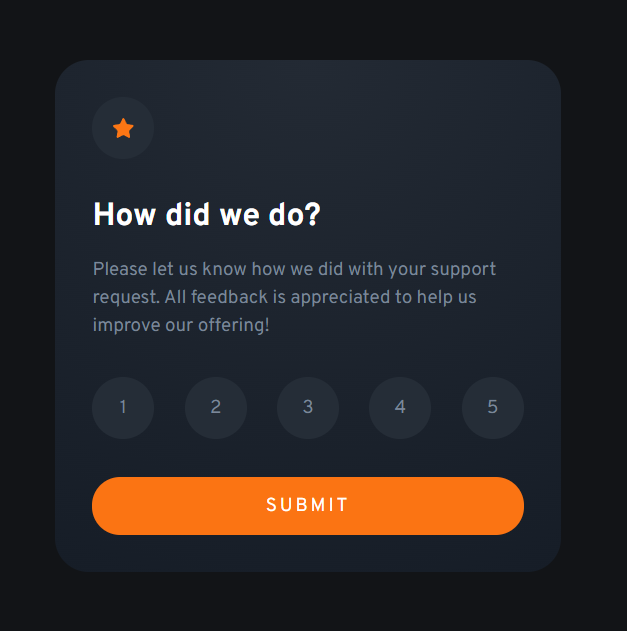

# Frontend Mentor - Interactive rating component solution

This is a solution to the [Interactive rating component challenge on Frontend Mentor](https://www.frontendmentor.io/challenges/interactive-rating-component-koxpeBUmI). Frontend Mentor challenges help you improve your coding skills by building realistic projects. 

## Table of contents

- [Overview](#overview)
  - [The challenge](#the-challenge)
  - [Screenshot](#screenshot)
  - [Links](#links)
- [My process](#my-process)
  - [Built with](#built-with)
  - [What I learned](#what-i-learned)
  - [Continued development](#continued-development)
  - [Useful resources](#useful-resources)
- [Author](#author)

## Overview

### The challenge

Users should be able to:

- View the optimal layout for the app depending on their device's screen size
- See hover states for all interactive elements on the page
- Select and submit a number rating
- See the "Thank you" card state after submitting a rating

### Screenshot




### Links

- Solution URL: [GitHub](https://github.com/min4899/Frontend-Mentor-Interactive-Rating-Component)
- Live Site URL: [GitHub Pages](https://min4899.github.io/Frontend-Mentor-Interactive-Rating-Component/)

## My process

### Built with

- Semantic HTML5 markup
- CSS custom properties
- Flexbox
- Javascript

### What I learned

I learned how to use Javascript to modify parts of the HTML frontend. Used functions like "document.getElementsByName" and "document.getElementsById" to retrieve certain elements and edit their properties.
I also learned about different types of inputs for HTML. This project specifically used radio type inputs for the rating functionality. We then use JavaScript to retrieve which radio button was selected and process the corresponding value.

```js
var ele = document.getElementsByName("rating");

let selectedRating;
for (let i = 0; i < ele.length; i++) {
  if (ele[i].checked) {
    selectedRating = ele[i].value;
    break;
  }
}
```

### Continued development

I'd like to focus on responsive layouts for different screens for future projects. This project had designs that showed slight changes to layouts between 375px and 1440 px that I couldn't manage to implement perfectly. 
I'd also like to learn how to properly change panels and hiding/showing different content. My implementation just had 2 divs for the 2 different states. After submitting a rating, the 1st state div would be set to `display: none` while the 2nd would set to `display: flex`.
I feel like there's a better solution, but this was the best I could think of at the time.

### Useful resources

- [Model Popup Box Using HTML CSS & Vanilla JAVASCRIPT || Popup Box With Emoji Rating Effects](https://youtu.be/3rqwjYda2KM) - This video helped me to create the custom radio buttons for the ratings part.
- [How to get value of selected radio button using JavaScript?](https://www.geeksforgeeks.org/how-to-get-value-of-selected-radio-button-using-javascript/#:~:text=To%20get%20the%20value%20of,is%20selected%20and%20False%20otherwise.) - This article helped me to figure how to access the ratings radio buttons in JavaScript.
- [CSS Clamp(): The Responsive Combination We’ve All Been Waiting For](https://blog.bitsrc.io/css-clamp-the-responsive-combination-weve-all-been-waiting-for-f1ce1981ea6e) - How to use clamp.

## Author

- GitHub - [Minwoo Soh](https://github.com/min4899)
- Frontend Mentor - [@min4899](https://www.frontendmentor.io/profile/min4899)